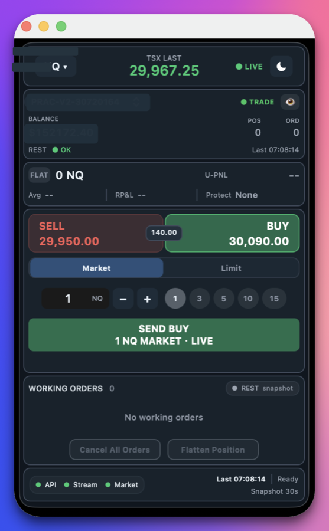
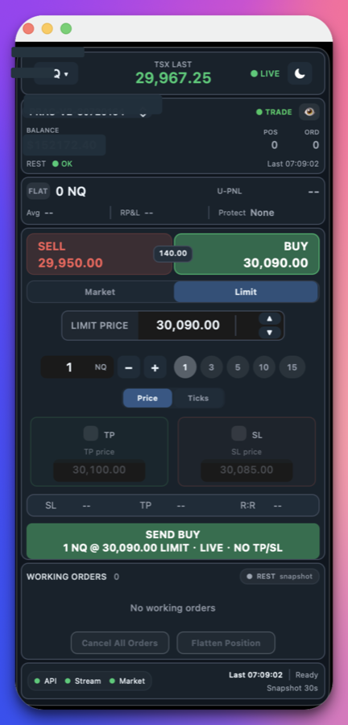
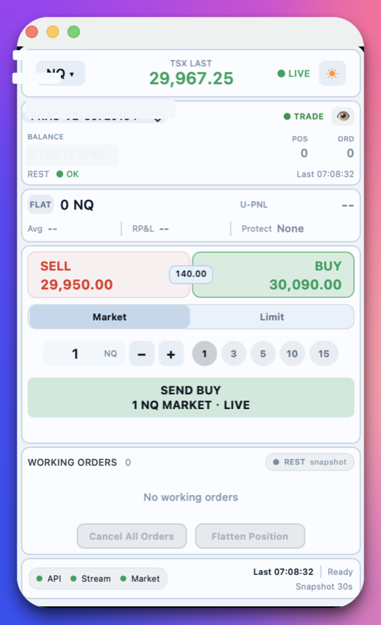
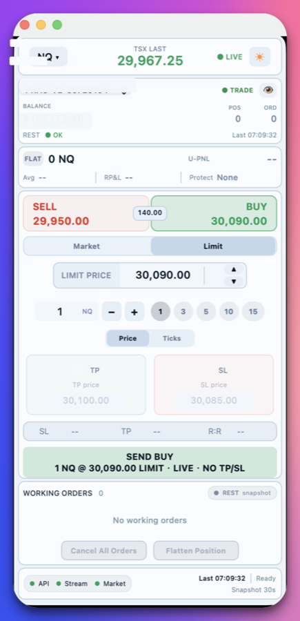

# TSX Deck

TSX Deck is a native macOS floating trading panel for the TopstepX / ProjectX Gateway API. It is designed for fast futures order entry with live quotes, account status, market and limit tickets, optional TP/SL bracket submission, working-order controls, and connection status visibility.

This project is unofficial and is not affiliated with, endorsed by, or sponsored by Topstep, TopstepX, or ProjectX.

**Keywords:** TopstepX, ProjectX Gateway API, macOS trading panel, futures trading, NQ, MNQ, ES, MES, market order, limit order, OCO bracket, TP/SL, AppKit.

## Screenshots

<p align="center">
  
  
  
  
</p>

## Status

This is an active personal trading tool. Treat it as experimental software. Always test with read-only mode or a non-critical environment before enabling live order submission.

## Features

- Native macOS AppKit floating panel.
- Real-time quote display from the ProjectX / TopstepX data stream.
- Market and limit order ticket.
- Optional TP/SL bracket support when official Auto OCO Brackets are enabled.
- Working orders panel with cancel-all and flatten-position actions.
- Account, position, average price, realized P&L, unrealized P&L, and connection status display when returned by the API.
- Bundled order and TP sound alerts.
- Example configuration only; real credentials are loaded from local Application Support.

## Latest UI Refinements

- Refined Market / Limit segmented control for a cleaner professional order-ticket flow.
- Reworked Limit ticket layout with inline limit price stepping, compact quantity controls, and clearer TP / SL cards.
- Improved Working Orders with a compact data-source pill, centered loading and empty states, and scroll-position preservation.
- Added a cleaner footer health strip for API, stream, and market status without changing trading logic.
- Kept the native panel width stable while allowing height to adapt to the active ticket and order list.

## Use Cases

- Fast discretionary futures execution from a compact always-on-top macOS panel.
- Monitoring TopstepX / ProjectX account status, current position, working orders, and API connectivity.
- Sending simple market and limit orders with optional official TP/SL bracket behavior.
- Keeping real API credentials outside the repository while shipping a reproducible open-source build.

## Requirements

- macOS 14 or later.
- Xcode Command Line Tools.
- A TopstepX / ProjectX account with API access.
- ProjectX API username and API key.

Install command line tools if needed:

```bash
xcode-select --install
```

## Build

```bash
cd outputs
chmod +x build_app.sh
./build_app.sh
open "TSX Deck.app"
```

The build script creates a universal macOS app and signs it ad hoc with hardened runtime. By default it bundles the safe example config. For a private portable build on your own Macs, you may place a real `topstepx_config.json` beside `outputs/build_app.sh`; the script will bundle that local file into the generated app, while `.gitignore` keeps it out of the repository.

## Configuration

Create your real local config here:

```text
~/Library/Application Support/TopstepXFloatPanel/topstepx_config.json
```

Start from the example:

```bash
mkdir -p "$HOME/Library/Application Support/TopstepXFloatPanel"
cp outputs/topstepx_config.example.json "$HOME/Library/Application Support/TopstepXFloatPanel/topstepx_config.json"
```

For a self-contained private copy between your own Macs, see `outputs/PORTABLE_README.txt`. Do not commit real config files or app bundles containing credentials.

Edit the file and keep `readOnly` set to `true` until quotes, accounts, positions, and order previews are verified:

```json
{
  "baseURL": "https://api.topstepx.com",
  "userName": "YOUR_TOPSTEPX_USERNAME",
  "apiKey": "YOUR_PROJECTX_API_KEY",
  "readOnly": true,
  "leadAccountId": null,
  "accountSize": "50K",
  "localDailyMaxLoss": 500,
  "localDailyProfitTarget": 800
}
```

Set `readOnly` to `false` only when you intentionally want the app to send live order requests.

## Official Settings Before Live Trading

Use the official TopstepX / ProjectX settings as the source of truth.

- Make sure your ProjectX API credentials are active.
- Select an account that is allowed to trade. Follower accounts may reject direct order placement.
- For plain market or limit orders without TP/SL, Auto OCO Brackets are not required.
- For automatic TP/SL bracket submission, enable official Auto OCO Brackets in TopstepX / ProjectX risk settings.
- If TopstepX asks you to switch from Position Brackets to Auto OCO Brackets, follow the official UI instructions. The official platform may require you to be flat before switching bracket modes.
- If the app shows `Bracket mode mismatch`, check the official bracket mode first.

## Order Usage Notes

- Market orders submit immediately and may fill with slippage.
- Limit orders submit at the entered limit price after tick normalization.
- TP/SL inputs are optional. If disabled, the order is submitted without those protection legs.
- If TP/SL is enabled, the app uses the official API response as the final success or failure signal.
- `Cancel All Orders` cancels working orders returned by the official open-orders endpoint.
- `Flatten Position` is intended to close the current open position for the selected contract, subject to official API acceptance.

## Safety

Futures trading can cause substantial losses. This software can send real orders when live mode is enabled. You are responsible for verifying account selection, symbol, quantity, order side, order type, price, TP/SL settings, and official platform status before trading.

Never commit real `topstepx_config.json`, API keys, account secrets, logs with tokens, or built app bundles containing local modifications.

## 中文说明

TSX Deck 是一个 macOS 原生 TopstepX / ProjectX Gateway API 悬浮交易面板，用于快速查看行情、账户状态、市价/限价下单、可选 TP/SL bracket、挂单管理、撤单、平仓和连接状态。

本项目不是 Topstep、TopstepX 或 ProjectX 官方项目，也没有获得官方背书。

### 当前状态

这是一个正在持续开发的个人交易工具。请先使用 `readOnly: true` 或非关键环境测试，确认行情、账户、持仓、挂单和订单预览都正确后，再考虑开启真实下单。

### 功能

- macOS AppKit 原生悬浮窗。
- 使用 ProjectX / TopstepX 官方实时行情流。
- 市价单和限价单输入。
- 官方 Auto OCO Brackets 开启后，可提交 TP/SL bracket。
- Working Orders 面板，可取消所有挂单和平仓。
- 根据 API 返回显示账户、持仓、均价、RP&L、U-PNL、连接状态。
- 内置订单和 TP 音效。
- 仓库只提供示例配置，真实凭据从本机 Application Support 读取。

### 最新界面优化

- 优化 Market / Limit 分段切换控件，让 Order Ticket 更简洁、专业。
- 重排 Limit 下单区域，加入一体化限价输入、紧凑数量控件和更清晰的 TP / SL 卡片。
- 优化 Working Orders，增加数据来源 pill、居中加载/空状态，并保留滚动位置。
- 优化底部状态栏，把 API、Stream、Market 连接状态集中成更干净的健康状态条。
- 保持原生悬浮窗宽度稳定，同时让高度随当前下单模式和挂单列表自适应。

### 构建

```bash
cd outputs
chmod +x build_app.sh
./build_app.sh
open "TSX Deck.app"
```

### 配置

真实配置文件位置：

```text
~/Library/Application Support/TopstepXFloatPanel/topstepx_config.json
```

第一次使用：

```bash
mkdir -p "$HOME/Library/Application Support/TopstepXFloatPanel"
cp outputs/topstepx_config.example.json "$HOME/Library/Application Support/TopstepXFloatPanel/topstepx_config.json"
```

先保持：

```json
"readOnly": true
```

确认全部正常后，只有在你明确要发送真实订单时，才改成：

```json
"readOnly": false
```

### 真实交易前必须确认

- ProjectX API 凭据已启用。
- 当前账户允许交易。Follower 账户可能不能直接下单。
- 普通市价/限价单不需要 Auto OCO Brackets。
- 如果要自动提交 TP/SL bracket，需要在 TopstepX / ProjectX 官方设置里启用 Auto OCO Brackets。
- 如果官方要求从 Position Brackets 切换到 Auto OCO Brackets，按官方页面操作，可能需要先空仓。
- 如果 App 显示 `Bracket mode mismatch`，优先检查官方 bracket 设置。

### 下单说明

- 市价单会立即发送，成交价可能有滑点。
- 限价单会按输入价格提交，并按最小 tick 做价格规范化。
- TP/SL 是可选项，未勾选时不会提交对应保护单。
- 所有订单成功/失败最终以官方 API 响应为准。
- `Cancel All Orders` 会取消官方 open orders 返回的挂单。
- `Flatten Position` 会尝试平掉当前合约持仓，最终仍以官方 API 接收为准。

### 风险提示

期货交易风险极高，可能造成重大亏损。开启 live 模式后，本软件可以发送真实订单。交易前请自行确认账户、商品、数量、方向、订单类型、价格、TP/SL 和官方平台状态。

不要把真实 `topstepx_config.json`、API Key、账户密钥、包含 token 的日志或带本地配置的打包产物提交到 GitHub。
