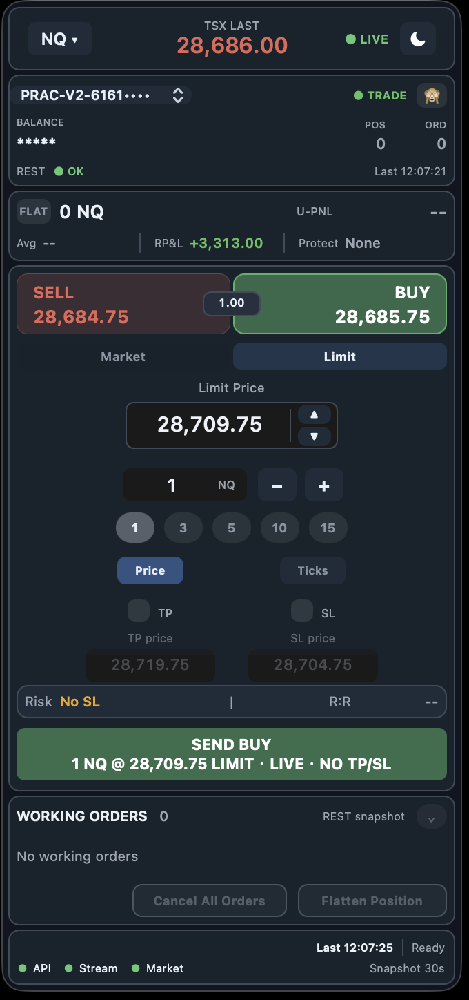

# TSX Deck 中文说明

TSX Deck 是一个 macOS 原生 TopstepX / ProjectX Gateway API 悬浮交易面板，用于快速查看行情、账户状态、市价/限价下单、可选 TP/SL bracket、挂单管理、撤单、平仓和连接状态。

本项目不是 Topstep、TopstepX 或 ProjectX 官方项目，也没有获得官方背书。

**关键词：** TopstepX、ProjectX Gateway API、macOS 交易面板、期货交易、NQ、MNQ、ES、MES、市价单、限价单、OCO bracket、TP/SL、AppKit。

## 截图

<p align="center">
  
  
  
</p>

## 适用场景

- 在 macOS 上使用紧凑的 always-on-top 原生悬浮窗进行快速期货下单。
- 查看 TopstepX / ProjectX 账户状态、当前持仓、挂单和 API 连接状态。
- 提交市价单、限价单，并按官方 Auto OCO Brackets 设置使用可选 TP/SL。
- 开源发布源码，同时把真实 API 凭据保留在本机配置文件中。

## 构建

```bash
cd outputs
chmod +x build_app.sh
./build_app.sh
open "TSX Deck.app"
```

## 配置

真实配置文件位置：

```text
~/Library/Application Support/TopstepXFloatPanel/topstepx_config.json
```

第一次使用：

```bash
mkdir -p "$HOME/Library/Application Support/TopstepXFloatPanel"
cp outputs/topstepx_config.example.json "$HOME/Library/Application Support/TopstepXFloatPanel/topstepx_config.json"
```

先保持 `"readOnly": true`。只有当你明确要发送真实订单时，才改成 `"readOnly": false`。

## 真实交易前必须确认

- ProjectX API 凭据已启用。
- 当前账户允许交易。Follower 账户可能不能直接下单。
- 普通市价/限价单不需要 Auto OCO Brackets。
- 如果要自动提交 TP/SL bracket，需要在 TopstepX / ProjectX 官方设置里启用 Auto OCO Brackets。
- 如果官方要求从 Position Brackets 切换到 Auto OCO Brackets，按官方页面操作，可能需要先空仓。
- 如果 App 显示 `Bracket mode mismatch`，优先检查官方 bracket 设置。

## 风险提示

期货交易风险极高。开启 live 模式后，本软件可以发送真实订单。交易前请自行确认账户、商品、数量、方向、订单类型、价格、TP/SL 和官方平台状态。

不要把真实 `topstepx_config.json`、API Key、账户密钥、包含 token 的日志或带本地配置的打包产物提交到 GitHub。

English documentation is available in [README.md](README.md).
